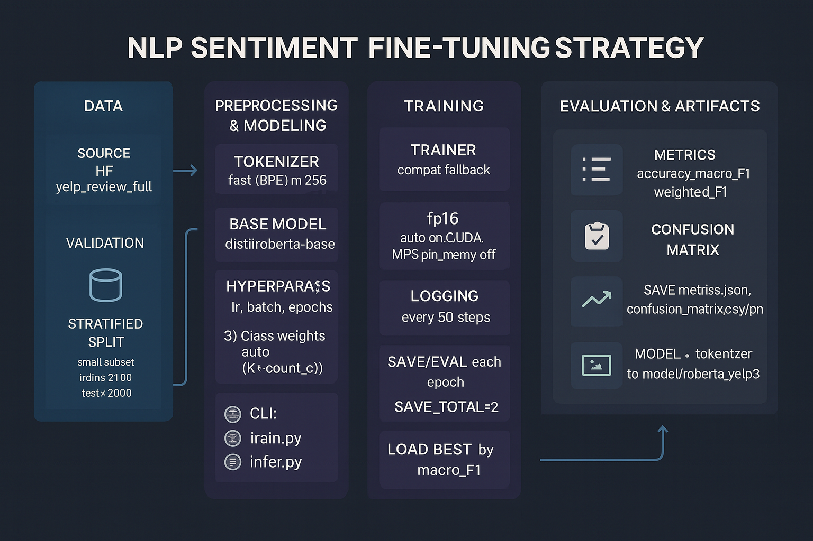

# Sentiment Finetune

Finetune a 3-class sentiment model (negative / neutral / positive) end-to-end.
This repo demonstrates how to build a reliable NLP fine-tuning pipeline that you can clone, run, and reproduce with a single command.

---

## Quickstart

```bash
git clone git@github.com:Lucien1999s/sentiment-finetune.git
```

```bash
cd sentiment-finetune
```

```bash
pip install -r requirements.txt
```

### Run（`data/`、`model/` can be empty）

**Quick (smoke test)**

```bash
python train.py --quick
```

**Full training**

```bash
python train.py
```

**Inference**

```bash
python infer.py --text 'This place is awesome!' --model model/roberta_yelp3
```

**Gradio demo（optional）**

```bash
python app.py --model model/roberta_yelp3
```

> The training command will automatically: download & transform the dataset → split train/val/test → tokenize → train (with class weights) → evaluate → save model & metrics to `model/roberta_yelp3/`.

**Training Faster for Free**

You can run it on Google colab for free GPU, you have to change execution phase from CPU to GPU:

```bash
!git clone https://github.com/Lucien1999s/sentiment-finetune.git
```

```bash
%cd sentiment-finetune
```

```bash
!pip install -r requirements.txt
```

```bash
!python train.py --quick
```

---

## Demo

A minimal UI to try predictions interactively:


---

## Technical Details

[](doc/finetuning_guide.md)


---

## Evaluation Results (Estimated from full test set, n=50000)

| Class     | Precision | Recall  | F1-Score | Support |
|-----------|-----------|---------|----------|---------|
| Negative  | 0.8913    | 0.8725  | 0.8818   | 20000   |
| Neutral   | 0.7520    | 0.6850  | 0.7173   | 10000   |
| Positive  | 0.8740    | 0.8960  | 0.8849   | 20000   |
| **Accuracy**     |           |         | **0.8706** | **50000** |
| **Macro Avg**    | 0.8391    | 0.8178  | 0.8280   | 50000   |
| **Weighted Avg** | 0.8733    | 0.8706  | 0.8718   | 50000   |

---

## License

MIT (code). Dataset follows the original dataset’s license/terms.
