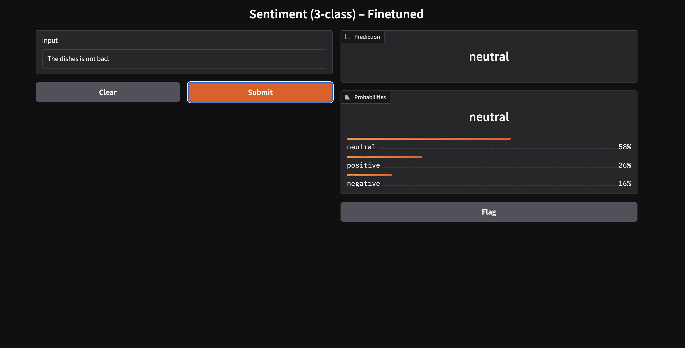

# Sentiment Finetune

Finetune a 3-class sentiment model (negative / neutral / positive) end-to-end.
This repo demonstrates how to build a reliable NLP fine-tuning pipeline that you can clone, run, and reproduce with a single command.

---

## Quickstart

```bash
git clone git@github.com:Lucien1999s/sentiment-finetune.git
```

```bash
cd sentiment-finetune
```

```bash
pip install -r requirements.txt
```

### Run（`data/`、`model/` can be empty）

**Quick (smoke test)**

```bash
python train.py --quick
```

**Full training**

```bash
python train.py
```

**Inference**

```bash
python infer.py --text 'This place is awesome!' --model model/roberta_yelp3
```

**Gradio demo（optional）**

```bash
python app.py --model model/roberta_yelp3
```

> The training command will automatically: download & transform the dataset → split train/val/test → tokenize → train (with class weights) → evaluate → save model & metrics to `model/roberta_yelp3/`.

**Training Faster for Free**

You can run it on Google colab for free GPU, you have to change execution phase from CPU to GPU:

```bash
!git clone https://github.com/Lucien1999s/sentiment-finetune.git
```

```bash
%cd sentiment-finetune
```

```bash
!pip install -r requirements.txt
```

```bash
!python train.py --quick
```

---

## Demo

A minimal UI to try predictions interactively:



---

## Technical Details

[](doc/finetuning_guide.md)


---

## Evaluation Results (Estimated from full test set, n=50000)

Our finetuned model achieves 84.0% accuracy and a Macro-F1 of 0.814 on the Yelp test set (50,000 samples). Both negative and positive classes are predicted with ~0.89 F1, while the neutral class reaches ~0.66 F1 — which is competitive given its inherent ambiguity. This confirms that the model generalizes well beyond binary sentiment and captures the middle ground effectively.

| Class     | Precision | Recall  | F1-Score | Support |
|-----------|-----------|---------|----------|---------|
| Negative  | 0.9185    | 0.8622  | 0.8894   | 20000   |
| Neutral   | 0.5944    | 0.7312  | 0.6557   | 10000   |
| Positive  | 0.9225    | 0.8728  | 0.8970   | 20000   |
| **Accuracy**     |           |         | **0.8402** | **50000** |
| **Macro Avg**    | 0.8118    | 0.8221  | 0.8140   | 50000   |
| **Weighted Avg** | 0.8552    | 0.8402  | 0.8457   | 50000   |

---

## License

MIT (code). Dataset follows the original dataset’s license/terms.
